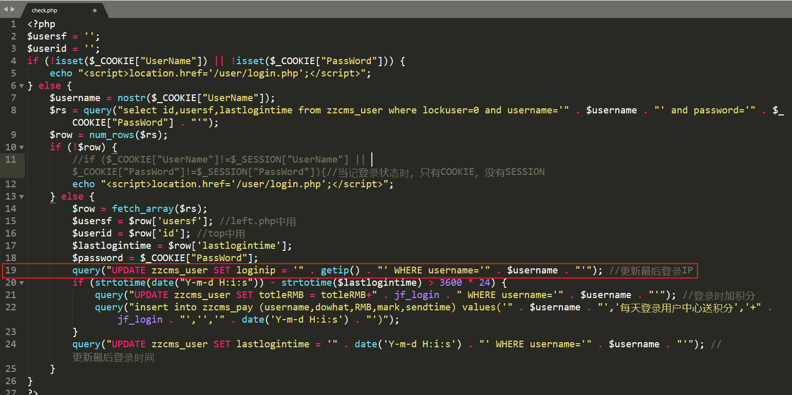
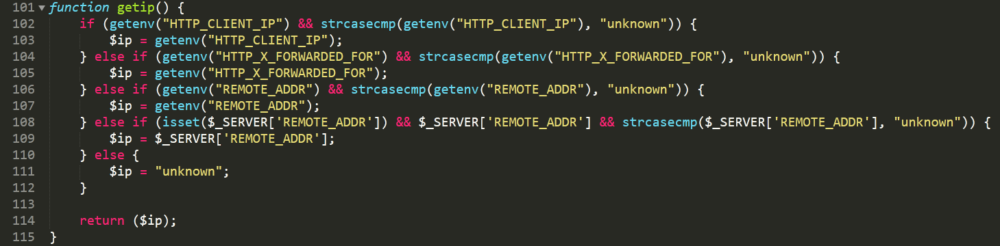
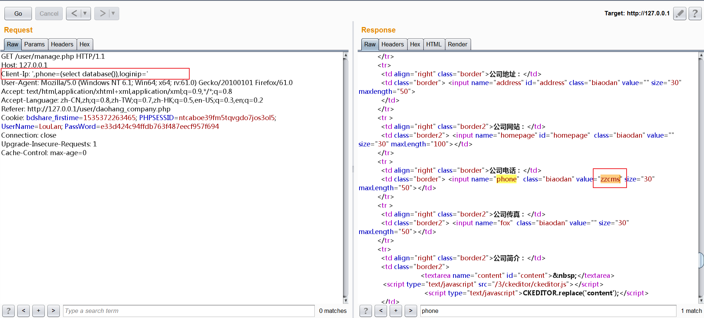
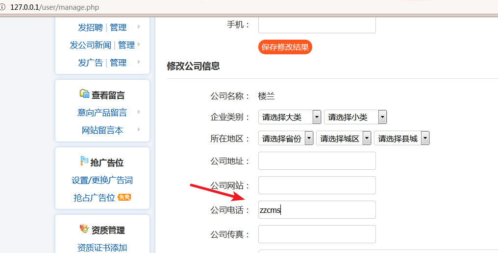

### Vul

[/user/check.php] is used to verify the user and record the user IP

[/inc/function.php] defines the function

We can control the IP through Client-Ip in the HTTP Header

### POC:
Client-Ip: ',phone=(select database()),loginip='
### Affected pages:
All pages that contain page /user/check.php。
### For Example:
/user/manage.php

